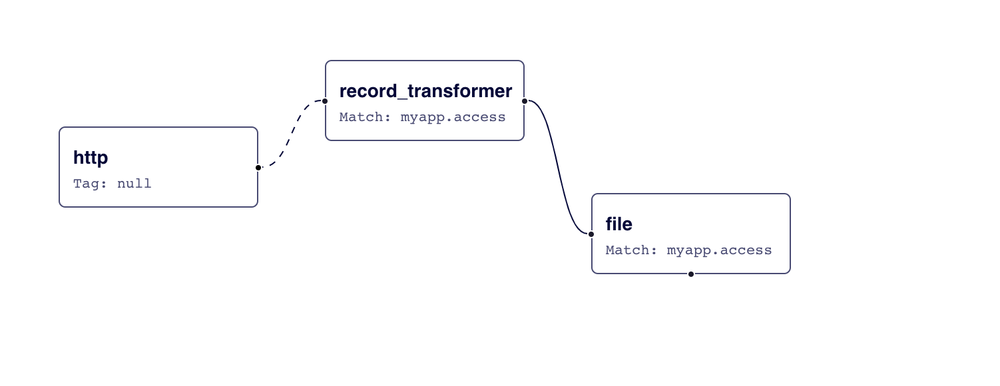

# FluentD
Fluentd is an open source data collector, which lets you unify the data collection and consumption for a better use and understanding of data.

## Config File
The configuration file consists of the following directives:

- **source** directives determine the input sources
- **match** directives determine the output destinations
- **filter** directives determine the event processing pipelines
- **system** directives set system-wide configuration
- **label** directives group the output and filter for internal routing
- **@include** directives include other files

### source
Each **source** directive must include a `@type` parameter to specify the input plugin to use. 

An event consists of three entities: **tag**, **time** and **record**. The `tag` is a string separated by dots (e.g. `myapp.access`), and is used as the directions for Fluentd internal routing engine. The `time` field is specified by input plugins, and it must be in the Unix time format. The `record` is a JSON object.

Since the `tag` is sometimes used in a different context by output destinations (e.g. the table name, database name, key name, etc.), **it is strongly recommended that you stick to the lower-case alphabets, digits and underscore** (e.g. ^[a-z0-9_]+$).

### match
The **match** directive looks for events with matching tags and processes them. The most common use of the `match` directive is to output events to other systems. For this reason, the plugins that correspond to the match directive are called **output plugins**.

Each `match` directive must include a match pattern and a `@type` parameter. Only events with a tag matching the pattern will be sent to the output destination.

### filter
The **filter** directive has the same syntax as `match` but `filter` could be chained for processing pipeline.

<p align="center">
    
</p>

### system
System-wide configurations are set by `system` directive. Most of them are also available via command line options. For example, the following configurations are available:

- log_level
- suppress_repeated_stacktrace
- emit_error_log_interval
- suppress_config_dump
- without_sourceprocess_name (Only available in `system` directive. No fluentd option)

### label
The **label** directive groups filter and output for internal routing. The `label` reduces the complexity of `tag` handling. The `label` parameter is a builtin plugin parameter so `@` prefix is needed.

### @include
The directives in separate configuration files can be imported using the `@include` directive:
```text
# Include config files in the ./config.d directory
@include config.d/*.conf
```
The `@include` directive supports regular file path, glob pattern, and http URL conventions:
```text
# absolute path
@include /path/to/config.conf

# if using a relative path, the directive will use
# the dirname of this config file to expand the path
@include extra.conf

# glob match pattern
@include config.d/*.conf

# http
@include http://example.com/fluent.conf
```

Attention:
```text
# If you have a.conf, b.conf, ..., z.conf and a.conf / z.conf are important

# This is bad
@include *.conf

# This is good
@include a.conf
@include config.d/*.conf
@include z.conf
```

## Some commands
### Install fluent-plugin
```shell
fluent-gem install fluent-plugin-grepcounter
```
or
```shell
gem install fluent-plugin-mail
```

### Check Configuration File
The configuration file can be validated without starting the plugins using the `--dry-run` option:
```shell
fluentd --dry-run -c fluent.conf
```

### Docker Example
After setting up the `in_http.conf`, run the following command:
```shell
curl -i -X POST -d 'json={"action":"login","user":2}' http://localhost:8888/test.cycle
```
Other possible commands:
```shell
curl -i -X POST -d 'json={"action":"logout","user":2}' http://localhost:8888/test.cycle
curl -i -X POST -d 'json={"action":"login","user":2}' http://localhost:8888/test.cycle
```

## Referencies
- [Overview](https://docs.fluentd.org/quickstart)
